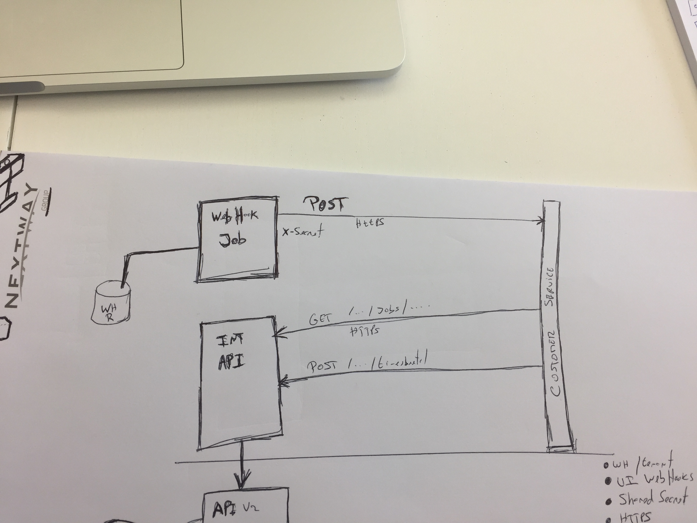

# Webhooks on Skills Workflow integration API

On Skills Workflow Integration API webhooks are setup **by tenant**.

Webhooks must be configured by the Skills Workflow team.

The following information must be provided:
* **URL** - the endpoint URL that Skills Workflow services invoke when the webhook is triggered;
* **Secret** - a secret value that is to be sent on every webhook request so the webhook endpoint is sure that the request comes from Skills Workflow

## Request

Skills Workflow API will make an HTTP POST request to the specified endpoint with a *JSON* payload containing a description of the event that triggered the webhook.

The request is always performed via HTTPS and will include a header (X-Webhook-Secret) containing the secret specified when the webhook was configured.

```http
POST /skillsevent HTTP/1.1
Host: webhook.example.com
Content-Type: application/json
X-Webhook-Secret: SOME_SECRET

{
    "action": "created",
    "document": {
        "type": "SkillsWorkflow.Job",
        "id": "32a8c937-2c65-463d-a292-e4c4e13ed263",
        "url": "https://integration-api-we.skillsworkflow.com/api/jobs/32a8c937-2c65-463d-a292-e4c4e13ed263"
    }
} 
```

### Payload

```json
{
    "action": "created",
    "document": {
        "type": "SkillsWorkflow.Job",
        "id": "32a8c937-2c65-463d-a292-e4c4e13ed263",
        "url": "https://integration-api-we.skillsworkflow.com/api/jobs/32a8c937-2c65-463d-a292-e4c4e13ed263"
    }
}
```

| Field                 | Description                                        
| --------------        | -------------------------------------------------- 
| action                | What type of action triggered this event           
| document              | Document on which the action was performed    

#### Action values

| Action                    | Description                                        
| --------------            | -------------------------------------------------- 
| created                   | The document was created
| updated                   | The document was updated
     

#### Document fields

| Field                 | Description                                        
| --------------        | -------------------------------------------------- 
| type                  | Type of the document (eg. Job, Project, etc)
| id                    | The document unique identifier
| url                   | The URL of the document on the API. You can make a GET request to this URL to read the document

##### Type values

* SkillsWorkflow.Job
* SkillsWorkflow.Project

## Sample diagram

This is an example of the interactions required to respond to a job created event and post some time against that job.


